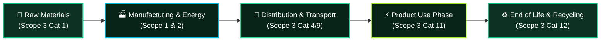
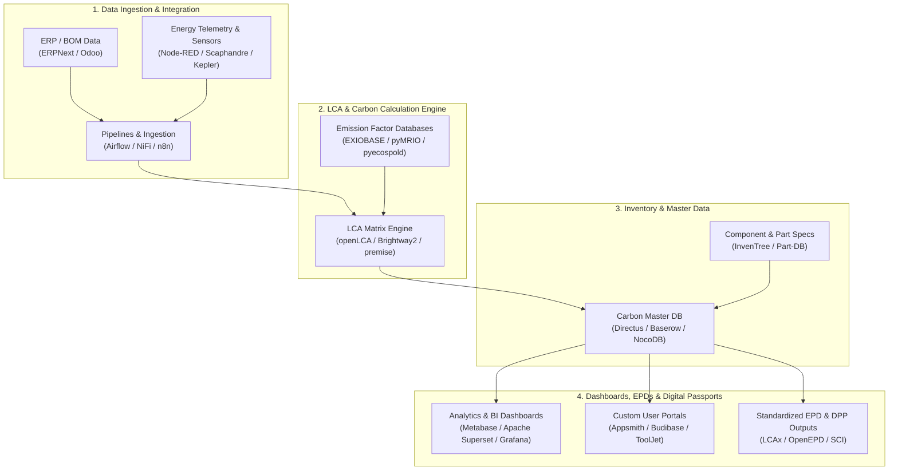

# 🌱 Awesome Product Carbon Footprint Platforms (PCF) & LCA Ecosystem

  
  
  
  
  
  
  
  

  

> 🌍 **Curated, production-grade guide to Product Carbon Footprint (PCF) SaaS platforms, Life Cycle Assessment (LCA) engines, Scope 3 supply-chain calculators, Environmental Product Declaration (EPD) tools, Digital Product Passports (DPP), and open-source industrial ecology libraries.**

---

## 📖 Table of Contents

- [🌟 Overview & Core PCF Architecture](#-overview--core-pcf-architecture)
- [🏢 SaaS & Hosted Commercial Platforms](#-saas--hosted-commercial-platforms)
  - [📊 Market Size & Industry Dynamics](#-market-size--industry-dynamics)
  - [📋 SaaS Comparison Table (Sorted by Company Scale)](#-saas-comparison-table)
- [🔓 Open-Source GitHub Repositories (Ranked by Stars)](#-open-source-github-repositories-ranked-by-stars)
- [🏗️ How to Build an Open-Source PCF Stack](#️-how-to-build-an-open-source-pcf-stack)
- [🤝 How to Contribute](#-how-to-contribute)
- [📈 Star History](#-star-history)
- [⚖️ Disclaimer & Standards Compliance](#️-disclaimer--standards-compliance)

---

## 🌟 Overview & Core PCF Architecture

A **Product Carbon Footprint (PCF)** measures the total greenhouse gas (GHG) emissions generated across the entire life cycle of a product—from raw material extraction (*cradle*) through manufacturing, logistics, and usage to end-of-life recycling or disposal (*grave*).

Key global standards governing PCF calculations include **ISO 14040/14044** (Life Cycle Assessment), **ISO 14067** (Carbon footprint of products), the **GHG Protocol Product Life Cycle Accounting and Reporting Standard**, the **EU Corporate Sustainability Reporting Directive (CSRD)**, the **EU Carbon Border Adjustment Mechanism (CBAM)**, and the **Catena-X** automotive network standard.

---

## 🏢 SaaS & Hosted Commercial Platforms

### 📊 Market Size & Industry Dynamics

> 💡 **Market Outlook:** The global Product Carbon Footprint (PCF) and Enterprise Carbon Accounting software market is estimated at **$15.8 Billion in 2026** and projected to expand to **$64.4 Billion by 2032** (a compound annual growth rate of **~26.4%**). The sector is **moderately to highly fragmented**—while enterprise ERP behemoths (SAP, IBM, Siemens, Workiva) anchor corporate-wide financial and ESG data pipelines, no single provider maintains a monopoly. Specialized Life Cycle Assessment (LCA) and supply-chain platforms maintain strong competitive moats driven by region-specific regulatory mandates (EU CSRD, CBAM, EU Battery Passport, SEC Climate Rules) and specialized primary emission factor databases.

### 📋 SaaS Comparison Table

| Platform | Company Valuation / Revenue Scale | Description | Starting Tier Pricing | Free Tier / Trial Limit |
| :--- | :--- | :--- | :--- | :--- |
| [**SAP Sustainability Footprint Management**](https://www.sap.com/products/sustainability/footprint-management.html) | `Enterprise Giant — $250B+ Market Cap ($34B Annual Revenue)` | Enterprise platform for calculating and managing granular product-level (PCF) and corporate-level (CCF) carbon footprints integrating directly with SAP S/4HANA operational and supply-chain transactional data. | Base add-on subscription starts at ~€24,000/year (~$26,000/year; ~$2,000/month) for SAP S/4HANA cloud landscapes | 30-day free trial environment via SAP Business Technology Platform (BTP) with standard pre-configured sample datasets |
| [**IBM Envizi ESG Suite**](https://www.ibm.com/products/envizi) | `Enterprise Giant — $210B+ Market Cap ($62B Annual Revenue)` | Comprehensive enterprise ESG and sustainability data platform supporting environmental data management, Scope 1-2-3 emissions accounting, CSRD reporting, and decarbonization analytics across multi-facility operations. | Standalone Envizi Emissions API starts from $45/month; complete Envizi ESG Suite starts at ~$30,000/year ($2,500/month) | No permanent free tier; guided interactive test-drive and live cloud demo sandbox accessible via IBM Portal |
| [**Siemens SiGREEN**](https://www.siemens.com/global/en/products/automation/topic-areas/sigreen.html) | `Global Industrial Leader — $150B+ Market Cap ($83B Annual Revenue)` | Industrial sustainability and Product Carbon Footprint data exchange network designed for cryptographic and Catena-X compliant PCF verification across manufacturing and tier-N supply chains. | Starter PCF exchange package begins at ~€15,000/year (~$16,500/year; ~$1,250/month) via Siemens Xcelerator | Interactive SiGREEN sandbox simulation demo upon request; zero-cost access for connected suppliers to exchange PCF certificates |
| [**EcoAct (SE Advisory Services)**](https://eco-act.com/) | `Enterprise Sustainability Arm of Schneider Electric ($130B+ Market Cap, $80M+ Division Revenue)` | Global climate consultancy and digital platform provider delivering comprehensive carbon footprinting, climate strategy roadmaps, internal carbon pricing models, and compliance reporting. | Base advisory and digital carbon footprint assessment modules start at ~$16,500/year (€15,000/year) | No self-service free tier; complimentary initial discovery assessment and diagnostic scoping demo upon consultation |
| [**Workiva ESG**](https://www.workiva.com/solutions/esg-reporting) | `Publicly Traded SaaS Leader — $4.8B Market Cap ($630M Annual Revenue)` | Connected reporting and governance platform unifying ESG data management, evidence collection, audit trails, and multi-framework disclosures (CSRD, SEC, ISSB, CDP, GRI). | Starts at ~$25,000/year (~$2,083/month billed annually) for core ESG compliance and reporting package | No open free tier or self-serve trial; custom guided workspace walkthrough and reporting workflow demo on request |
| [**EcoVadis**](https://ecovadis.com/) | `ESG Rating Unicorn — $3.0B+ Valuation (~$180M+ Annual Revenue)` | Global supply chain sustainability rating and carbon-action platform providing structured scorecard assessments, benchmark intelligence, and supplier decarbonization tracking across 130,000+ businesses. | Basic plan starts at €350/year (~$380/year for companies with <25 employees); Premium tiers start from ~€1,800/year (~$1,950/year) | Free Carbon Rating tier available for eligible suppliers; 6-week free completion period for invited suppliers prior to scorecard finalization |
| [**Watershed**](https://watershed.com/) | `Climate Tech Unicorn — $1.8B Valuation (~$50M+ Annual Revenue)` | Enterprise climate platform powering granular Scope 1-3 measurement, supplier engagement, CEDA environmental databases, product emissions modeling, and audit-ready disclosure. | Starts at ~$37,000/year (~$3,083/month billed annually; implementation and onboarding typically $10,000–$25,000) | No permanent free tier or self-serve trial; guided sales pilot / PoC sandboxes provided for qualified enterprise accounts; free open CEDA database download |
| [**Sphera Product Sustainability**](https://sphera.com/product-sustainability-software/) | `Enterprise ESG & LCA Leader — $1.4B Valuation (Blackstone Portfolio, $140M+ Revenue)` | Industry-leading life cycle assessment (LCA) and product sustainability suite (formerly GaBi / LCA for Experts) featuring managed industrial databases for EPDs, PCFs, and circularity. | Starts at ~$6,500/year (~€6,000/year; ~$540/month per named user) for standard LCA for Experts desktop/cloud packages | 45-day free trial for LCA for Experts (formerly GaBi) with standard dataset access; extended 6-month free educational license for accredited university faculty & PhD researchers |
| [**Persefoni**](https://www.persefoni.com/) | `Climate SaaS Leader — $700M – $800M Valuation (Raised $150M+)` | AI-powered climate accounting and carbon management platform delivering GHG Protocol compliant calculation engines, PCAF financial emissions tracking, and CSRD/SEC ready audits. | Free ($0) for Persefoni Pro; paid enterprise and advanced disclosure packages start at ~$55,000/year (~$4,580/month) | Free-forever plan ("Persefoni Pro") limited to 1 user seat, baseline Scope 1 & 2 + select Scope 3 accounting, excluding advanced reporting & audit modules |
| [**One Click LCA**](https://www.oneclicklca.com/) | `LCA & Embodied Carbon Leader — $250M – $300M Valuation (Raised €40M)` | Global automated Life Cycle Assessment and Environmental Product Declaration (EPD) platform specialized in embodied carbon, construction materials, infrastructure, and manufacturing PCF. | Starter Business LCA license starts from €1,190/year (~$1,300/year; approx. €99/month per named user) | 14-day free trial for building & infrastructure LCA modules (instant online registration); 100% free Building LCA license for enrolled students & university instructors |
| [**Sweep**](https://www.sweep.net/) | `Enterprise Climate SaaS — $180M – $200M Valuation (Raised $100M)` | Data-driven carbon management platform supporting multi-entity enterprise emissions inventories, value-chain mapping, reduction pathways, and compliance reporting. | Starts at €250/month (€3,000/year) for entry module access; comprehensive enterprise suites start at ~€30,000/year (~$32,500/year) | No permanent free tier; guided interactive demo sandbox available on request upon sales consultation (no open self-service trial days) |
| [**Greenly**](https://greenly.earth/) | `High-Growth Carbon Platform — $160M – $180M Valuation (Raised $75M)` | Automated carbon accounting platform connecting with accounting, financial, ERP, and physical activity data to calculate corporate carbon footprints and product-level life cycle emissions. | Starts at $1,950/year (~$162.50/month billed annually) for entry SME GHG assessment and reporting | Free standalone web calculators (AI Carbon Footprint, Quick Carbon, and CSRD/CBAM eligibility tools); guided platform demo on request (no self-serve free trial) |
| [**Plan A**](https://plana.earth/) | `Decarbonization SaaS — $120M – $150M Valuation (Raised $40M+)` | Corporate carbon accounting, decarbonization planning, and ESG reporting software helping businesses map emissions, set SBTi science-based targets, and streamline CSRD disclosures. | Starts at ~$13,000/year (€12,000/year; ~$1,080/month billed annually) for mid-market carbon accounting | No permanent free tier; guided demo and short sandbox testing environment available upon sales qualification (no open self-service free trial) |
| [**Normative**](https://normative.io/) | `Carbon Intelligence Platform — $100M – $130M Valuation (Raised $40M+)` | Science-backed enterprise carbon accounting engine specialized in automated Scope 3 hotspot discovery, supplier transaction categorization, and net-zero reduction planning. | Starts at ~$11,000/year (€10,000/year; ~$915/month billed annually) for baseline corporate accounting | Free Business Carbon Calculator for SMEs (unlimited basic Scope 1, 2, and spend-based Scope 3 estimations); guided demo on request (no full-platform free trial) |
| [**SINAI Technologies**](https://www.sinaitechnologies.com/) | `Decarbonization Intelligence — $70M – $90M Valuation (Raised $22M)` | Enterprise decarbonization intelligence platform helping heavy industry and transport companies model marginal abatement cost curves (MACC), internal carbon pricing, and scenario forecasts. | Starts at ~$20,000/year (~$1,666/month billed annually) for baseline module and decarbonization scenario modelling | No self-service free tier; custom scenario-modelling demo sandbox provided upon consultation |
| [**CarbonChain**](https://www.carbonchain.com/) | `Industrial Carbon SaaS — $60M – $80M Valuation (Raised $14M+)` | Supply-chain carbon accounting and decarbonization platform focused on calculating product-level (PCF) and asset-level emissions for metals, mining, energy, and commodity trade finance. | Starts at ~$32,000/year (£25,000/year; ~$2,667/month billed annually) for core industrial modules | 14-day free trial for CBAM reporting and supplier catalogue modules; free standalone Corporate Carbon and ETS Exposure calculators (no permanent free tier for core SaaS) |
| [**MakerSights Sustainability**](https://www.makersights.com/) | `Product Intelligence SaaS — $50M – $70M Valuation (Raised $35M+)` | Consumer product intelligence platform enabling apparel and retail design teams to test consumer demand, simulate sustainable materials, and minimize overproduction waste. | Starts at ~$15,000/year (~$1,250/month billed annually) for product intelligence & sustainability modules | No self-serve free tier or open trial; guided custom product prototype testing demo available upon request |
| [**Worldly (formerly Higg)**](https://worldly.io/) | `Consumer Goods Sustainability Network — $50M+ Scale (Raised $50M+, ~$25M Revenue)` | Primary sustainability data platform for the global apparel, footwear, and consumer goods industry, hosting the Higg Index suite (Higg FEM, MSI, FSLM, PM) for materials and facility LCA data. | Entry single-facility assessment subscriptions start at $99 – $350/year; full brand analytics modules start around $2,500/year (~$208/month) | Free basic user account for receiving and viewing shared Higg Index assessment scores from supply chain partners; free introductory training modules |
| [**SimaPro**](https://simapro.com/) | `Global LCA Gold Standard — 30+ Years Market Leader (~$20M Revenue)` | Pioneering professional Life Cycle Assessment desktop and cloud platform used by 10,000+ LCA practitioners in 80+ countries for detailed ISO 14040/44 product modeling, sensitivity analysis, and Ecoinvent calculations. | SimaPro Expert single-user annual subscription starts at €3,500/year (~$3,800/year; approx. €290/month); permanent licenses from ~€8,500 | 30-day free trial with demo datasets (limited Ecoinvent records); 1-year free Faculty plan for educational institutions in UN-classified low/lower-middle income countries |
| [**Manufacture 2030 (Secaro / M2030)**](https://manufacture2030.com/) | `Supply Chain Decarbonization — $20M – $30M Valuation (Raised £10M+)` | Manufacturing sustainability and supply-chain decarbonization platform helping enterprise buyers engage thousands of manufacturing suppliers to measure factory emissions and implement site reduction plans. | Buyer enterprise sponsorship programs start at ~$19,000/year (£15,000/year; ~$1,580/month); basic supplier data entry is free when invited by enterprise buyers | Zero-cost access for suppliers invited by enterprise customers to input site-level manufacturing data; interactive platform demo on request |
| [**Circularise**](https://www.circularise.com/) | `Digital Product Passport Pioneer — $20M – $30M Valuation (Raised €11M+)` | Supply-chain traceability and Digital Product Passport (DPP) platform using smart question technology (zero-knowledge proofs) to share verified material composition and PCF data without revealing IP. | Starting traceability and Digital Product Passport (DPP) pilot packages begin from €18,000/year (~$19,500/year; ~€1,500/month) | No self-service free tier; interactive DPP sandbox walkthrough and sample batch traceability demo available on request |
| [**Emitwise**](https://emitwise.com/) | `Supply Chain Carbon Platform — Raised $17M (Acquired by Green Project Technologies)` | Automated Scope 3 carbon accounting platform designed to help manufacturers, construction firms, and complex supply chains track and eliminate product-level carbon hotspots. | Starts at ~$9,500/year (£7,500/year; ~$790/month billed annually) for entry mid-market tier | Free zero-cost data-entry portal for suppliers invited by enterprise customers; free public SME Climate Hub calculator (no self-serve free trial for core SaaS) |
| [**Pathzero**](https://www.pathzero.com/) | `Asset Management Carbon SaaS — $15M – $20M Valuation (Raised AU$15M+)` | Carbon accounting and portfolio climate disclosure platform purpose-built for private market fund managers, institutional investors, and enterprise corporations. | Starts at ~$18,000/year (~$1,500/month billed annually) for entry portfolio carbon accounting and disclosure | No permanent free tier; interactive guided product walkthrough and sandbox demo available on request |
| [**eTool (eToolLCD / Cerclos)**](https://etoolglobal.com/) | `Infrastructure & Building LCA Specialist — Established Global Platform (~$4M Revenue)` | Cloud-based Life Cycle Assessment and Environmental Product Declaration platform compliant with ISO 14044 and EN 15978 for calculating embodied and operational carbon in the built environment. | Starter subscription starts at ~$1,200/year (~$100/month) plus project certification fees; single-project access from ~$250/project | 14-day free trial with sample project templates; free online software training courses and free Revit LCA plugin download |

---

## 🔓 Open-Source GitHub Repositories (Ranked by Stars)

The open-source ecosystem provides transparent, peer-reviewed, and ISO-compliant scientific engines, data models, telemetry collectors, and low-code applications essential for building custom PCF calculation pipelines. Below are notable open-source repositories **sorted in descending order by live GitHub stargazers**.

| Repository | Stars Badge | Description & Focus Area |
| :--- | :--- | :--- |
| [**n8n**](https://github.com/n8n-io/n8n) |  | Workflow automation platform for orchestrating sustainability, procurement, and supplier data pipelines. |
| [**Grafana**](https://github.com/grafana/grafana) |  | Leading open-source observability, monitoring, and interactive visualization platform for operational energy and emissions metrics. |
| [**Apache Superset**](https://github.com/apache/superset) |  | Enterprise-ready BI and data exploration platform suited for large-scale supply chain and carbon footprint analytics. |
| [**NocoDB**](https://github.com/nocodb/nocodb) |  | Open-source Airtable alternative that turns any database into a smart PCF inventory and supplier tracking spreadsheet. |
| [**Odoo Community**](https://github.com/odoo/odoo) |  | Open-source ERP suite with inventory, manufacturing, purchase, and logistics modules that serve as an enterprise PCF data backbone. |
| [**Metabase**](https://github.com/metabase/metabase) |  | Open-source business intelligence platform for creating interactive Scope 1-3 emissions dashboards and PCF visualizations. |
| [**Apache Airflow**](https://github.com/apache/airflow) |  | Programmatic workflow orchestration platform for automating supplier data ingestion, emission-factor syncs, and PCF pipelines. |
| [**ToolJet**](https://github.com/ToolJet/ToolJet) |  | Open-source low-code framework for developing internal sustainability apps connected to databases and environmental APIs. |
| [**Appsmith**](https://github.com/appsmithorg/appsmith) |  | Open-source low-code framework to build custom internal carbon accounting tools, approval workflows, and PCF dashboards. |
| [**ERPNext**](https://github.com/frappe/erpnext) |  | Full-featured open-source ERP system providing BOMs, manufacturing logs, item masters, and supply chain data for PCF calculations. |
| [**Directus**](https://github.com/directus/directus) |  | Open-source data engine & real-time REST/GraphQL API for managing product bills-of-materials, LCA datasets, and supplier records. |
| [**Budibase**](https://github.com/Budibase/budibase) |  | Open-source low-code platform for building supplier data entry forms, carbon audit workflows, and ESG portals. |
| [**Node-RED**](https://github.com/node-red/node-red) |  | Low-code flow-based programming environment for connecting IoT sensors, factory meters, ERPs, and carbon calculation APIs. |
| [**OpenRefine**](https://github.com/OpenRefine/OpenRefine) |  | Powerful open-source tool for cleaning, transforming, and normalizing dirty supplier datasets and emission factor tables. |
| [**InvenTree**](https://github.com/inventree/InvenTree) |  | Open-source inventory, parts, and BOM management platform providing structured component data for cradle-to-gate LCA modeling. |
| [**Apache NiFi**](https://github.com/apache/nifi) |  | Enterprise data ingestion and transformation platform for routing manufacturing, logistics, and telemetry data to carbon models. |
| [**Baserow**](https://github.com/baserow/baserow) |  | Open-source collaborative database platform for product carbon inventories, emission factor libraries, and review workflows. |
| [**Electricity Maps Contrib**](https://github.com/electricitymaps/electricitymaps-contrib) |  | Open-source model and data pipeline providing real-time and forecasted carbon intensity for global electricity grids. |
| [**PyPSA**](https://github.com/PyPSA/PyPSA) |  | Python framework for simulating and optimizing regional and national power systems and energy decarbonization scenarios. |
| [**Scaphandre**](https://github.com/hubblo-org/scaphandre) |  | Low-level energy consumption metrics exporter for bare-metal and virtualized computing infrastructure. |
| [**CodeCarbon**](https://github.com/mlco2/codecarbon) |  | Lightweight Python library to track and estimate equivalent CO2 emissions produced by compute workloads and ML models. |
| [**Part-DB**](https://github.com/Part-DB/Part-DB-server) |  | Electronic component and parts inventory management database with structured supplier and lifecycle metadata. |
| [**Kepler**](https://github.com/sustainable-computing-io/kepler) |  | Kubernetes Efficient Power Level Exporter using eBPF to monitor energy consumption of containers, pods, and nodes in real time. |
| [**Cloud Carbon Footprint**](https://github.com/cloud-carbon-footprint/cloud-carbon-footprint) |  | Comprehensive multi-cloud tool for measuring, analyzing, and reducing carbon emissions and energy consumption in AWS, GCP, and Azure. |
| [**Carbon Aware SDK**](https://github.com/Green-Software-Foundation/carbon-aware-sdk) |  | SDK and Web API to build carbon-responsive applications that shift compute workloads to greenest grid windows. |
| [**CarbonTracker**](https://github.com/saintslab/carbontracker) |  | Tool for tracking, predicting, and reducing the energy and carbon footprint of training deep learning models. |
| [**CLIMADA**](https://github.com/CLIMADA-project/climada_python) |  | Probabilistic natural catastrophe and climate risk assessment platform for modeling climate impact economics. |
| [**oemof-solph**](https://github.com/oemof/oemof-solph) |  | Modular open-source framework for modeling, optimizing, and simulating multi-commodity energy systems. |
| [**Calliope**](https://github.com/calliope-project/calliope) |  | Multi-scale spatial and temporal energy system modeling framework for analyzing renewable transition pathways. |
| [**Software Carbon Intensity (SCI)**](https://github.com/Green-Software-Foundation/sci) |  | Open standard specification to calculate rate of carbon emissions for software systems across execution and hardware lifecycles. |
| [**Experiment Impact Tracker**](https://github.com/Breakend/experiment-impact-tracker) |  | Automated experiment monitoring tool capturing compute hardware energy, CPU/GPU utilization, and real-time carbon intensity. |
| [**Eco2AI**](https://github.com/sb-ai-lab/Eco2AI) |  | Python library designed to evaluate carbon footprint and energy efficiency of machine learning training algorithms. |
| [**openLCA**](https://github.com/GreenDelta/olca-app) |  | Industry-standard open-source modular Life Cycle Assessment application for detailed cradle-to-grave product footprints and EPDs. |
| [**pyMRIO**](https://github.com/IndEcol/pymrio) |  | Python package for processing Multi-Regional Input-Output (MRIO) databases (EXIOBASE, WIOD, Eora) for supply chain carbon footprints. |
| [**Activity Browser**](https://github.com/LCA-ActivityBrowser/activity-browser) |  | Open-source graphical desktop interface for Brightway-based LCA projects, databases, and impact assessments. |
| [**Premise**](https://github.com/polca/premise) |  | Python library for prospective LCA, coupling integrated assessment models (IAMs) with ecoinvent databases for future scenarios. |
| [**Impact Framework**](https://github.com/Green-Software-Foundation/if) |  | Standardized framework from the Green Software Foundation to model, measure, and compute software application carbon footprints. |
| [**Switch Power Model**](https://github.com/switch-model/switch) |  | Modular power system planning platform for modeling high-penetration renewable grid transitions and generation emissions. |
| [**Brightway (brightway2)**](https://github.com/brightway-lca/brightway2) |  | Modular, high-performance Python framework for advanced, programmatic, and matrix-based Life Cycle Assessment calculations. |
| [**TEMOA**](https://github.com/TemoaProject/temoa) |  | Open-source energy economy optimization modeling framework for evaluating energy policy and carbon constraints. |
| [**pycontrails**](https://github.com/contrailcirrus/pycontrails) |  | Python library for modeling aviation emissions, climate forcing, contrail formation, and flight path decarbonization. |
| [**BoaviztAPI**](https://github.com/Boavizta/boaviztapi) |  | Open-source REST API to evaluate the multi-criteria environmental footprint of digital equipment, servers, and cloud resources. |
| [**Wurst**](https://github.com/polca/wurst) |  | Python library for synthesizing, manipulating, and transforming large-scale Life Cycle Inventory (LCI) databases. |
| [**openLCA Python IPC**](https://github.com/GreenDelta/olca-ipc.py) |  | Python client interface for programmatic communication, data extraction, and calculation runs on openLCA. |
| [**Boavizta Cloud Scanner**](https://github.com/Boavizta/cloud-scanner) |  | CLI scanner that inspects cloud infrastructure configurations (AWS/GCP) to compute embodied and operational emissions. |
| [**BoAgent**](https://github.com/Boavizta/boagent) |  | Environmental impact monitoring agent running on Linux/Windows servers to stream hardware telemetry to BoaviztAPI. |
| [**Datavizta**](https://github.com/Boavizta/datavizta) |  | Interactive visualization dashboard for exploring environmental footprints of digital hardware and infrastructure components. |
| [**OSeMOSYS**](https://github.com/OSeMOSYS/OSeMOSYS_GNU_MathProg) |  | Open-source energy system modeling framework for long-term energy planning and emissions trajectory analysis. |
| [**Green Algorithms Tool**](https://github.com/Green-Algorithms/green-algorithms-tool) |  | Interactive computational carbon calculator designed to standardize the environmental footprint of scientific algorithms. |
| [**LCAx**](https://github.com/kongsgaard/lcax) |  | Open-source data exchange format and validator for Life Cycle Assessments and Environmental Product Declarations (EPD). |
| [**LCA-Algebraic**](https://github.com/o-alexandre/LCA-Algebraic) |  | Python extension for Brightway2 enabling symbolic algebra, parameter sensitivity, and fast uncertainty calculations in LCA models. |
| [**pyecospold**](https://github.com/Sustainability-Lab-Capenergies/pyecospold) |  | Python library for parsing, validating, and generating EcoSpold 1 and EcoSpold 2 XML datasets for LCA data exchange. |
| [**Lcopt**](https://github.com/jamesjoyce/lcopt) |  | Interactive Python module and UI for constructing, visualizing, and parameterizing foreground product systems in LCA. |
| [**Boavizta e-footprint**](https://github.com/Boavizta/efootprint) |  | Life-cycle assessment engine for calculating the environmental footprint of digital services and computing architectures. |
| [**ODYM**](https://github.com/StefanPauliuk/ODYM) |  | Open Dynamic Material Systems Model for dynamic material flow analysis (MFA) and product stock-flow lifespan modeling. |
| [**pymfa**](https://github.com/IndEcol/pymfa) |  | Python library for substance and material flow analysis across product lifecycles and recycling loops. |

---

## 🏗️ How to Build an Open-Source PCF Stack

You can build a production-grade, reproducible, audit-ready Product Carbon Footprint architecture entirely with open-source tools:

---

## 🤝 How to Contribute

Contributions to this awesome list are enthusiastically welcomed! To contribute:

1. 🍴 **Fork** this repository.
2. 🌿 **Create a branch** for your addition (`git checkout -b add-my-platform`).
3. 📝 **Add your entry** following the table format (Platform name, canonical website link, accurate pricing & free tier details or GitHub repo with stars badge).
4. 🧪 **Ensure all links are valid** and descriptions remain objective, technical, and factual.
5. 🚀 **Submit a Pull Request** with a clear explanation of why the tool belongs here.

Explore more curated lists on [Awesome-Awesome-Awesome](https://github.com/ishandutta2007/Awesome-Awesome-Awesome)!

---

## 📈 Star History

---

## ⚖️ Disclaimer & Standards Compliance

- 📌 **Community-Curated:** This repository is maintained for informational and educational purposes. Inclusion does not constitute a formal commercial endorsement.
- 🔬 **Methodology Variations:** Product Carbon Footprint calculations may differ substantially depending on boundary limits (*cradle-to-gate* vs. *cradle-to-grave*), allocation models (mass, economic, energy), database vintage, and regional grid emission factors.
- 📑 **Audit & Verification:** Automated calculations do not replace certified verification. Always validate final PCF claims against accredited third-party verifiers when preparing official EPDs, CSRD filings, or CBAM declarations.

Made with 💚 for sustainability engineers, LCA practitioners, supply-chain leaders, and open-source climate developers.

